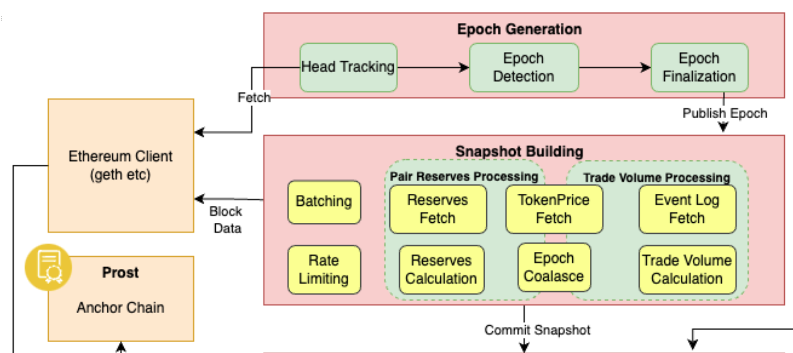

## Table of Contents

- [Overview](#overview)
- [Epoch Generation](#epoch-generation)
- [Snapshot Building](#snapshot-building)
  - [Token Price in USD](#token-price-in-usd)
  - [Pair Metadata](#pair-metadata)
  - [Liquidity / Pair Reserves](#liquidity--pair-reserves)
  - [Fetch event logs](#fetch-event-logs)
  - [Pair trade volume](#pair-trade-volume)
  - [Rate Limiter](#rate-limiter)
  - [Batching RPC calls](#batching-rpc-calls)


## Overview

Pooler is the component of a fully functional, distributed system that works alongside Audit Protocol and together they are responsible for
* generating a time series database of changes occuring over smart contract state data and event logs, that live on decentralized storage protocols
* higher order aggregated information calculated over decentralized indexes maintained atop the database mentioned above

Pooler by itself, performs the following functions:

1. Tracks the blockchain on which the data source smart contract lives
2. In equally spaced 'epochs'
	* it snapshots raw smart contract state variables, event logs etc 
	* transforms the same
	* and submits these snapshots to audit-protocol


This specific implementation is called Pooler since it tracks Uniswap v2 'pools'.

Together with an Audit Protocol instance, they form a recently released PoC whose objectives were 

- to present a fully functional, distributed system comprised of lightweight services that can be deployed over multiple instances on a network or even on a single instance
- to be able to serve most frequently sought data points on Uniswap v2
    - Total Value Locked (TVL)
    - Trade Volume, Liquidity reserves, Fees earned
        - grouped by
            - Pair contracts
            - Individual tokens participating in pair contract
        - aggregated over time periods
            - 24 hours
            - 7 days
    - Transactions containing `Swap` , `Mint` , `Burn` events


You can read more about Audit Protocol and the Uniswap v2 PoC in the  [Powerloom Protocol Overview document](https://www.notion.so/powerloom/PowerLoom-Protocol-Overview-c3bf9dd9323541118d46a4d8684565d1#8ad76b8362b341bcaa9b3ae9fe203271)




## Epoch Generation

An epoch denotes a range of block heights on the data source blockchain, Ethereum mainnet in the case of Uniswap v2. This makes it easier to collect state transitions and snapshots of data on equally spaced block height intervals, as well as to support future work on other lightweight anchor proof mechanisms like Merkle proofs, succinct proofs etc. 

The size of an epoch is configurable. Let that be referred to as `size(E)`

- A service keeps track of the head of the chain as it moves ahead, and a marker `h₀` against the max block height from the last released epoch. This makes the beginning of the next epoch, `h₁ = h₀ + 1`

- Once the head of the chain has moved sufficiently ahead so that an epoch can be published, an epoch finalization service takes into account the following factors
    - chain reorganization reports where the reorganized limits are a subset of the epoch qualified to be published
    - a configurable ‘offset’ from the bleeding edge of the chain

 and then publishes an epoch `(h₁, h₂)` so that `h₂ - h₁ + 1 == size(E)`. The next epoch therefore is tracked from `h₂ + 1`.


## Snapshot Building

Overview of broadcasted epoch processing, building snapshot, and submitting it to audit-protocol ([whitepaper-ref](https://www.notion.so/powerloom/PowerLoom-Protocol-Overview-c3bf9dd9323541118d46a4d8684565d1#8ad76b8362b341bcaa9b3ae9fe203271)):

1. Published/broadcasted epochs are received by `PairTotalReservesProcessorDistributor`, and get distributed to callback workers by publishing messages on respective queues ([code-ref](https://github.com/PowerLoom/fpmm-pooler-internal/blob/a8b8d0fa9fb7da51c8cad4e5509b1d56a92c23f5/callback_modules/pair_total_reserves.py#L621-L645)).    
[Distributor code-module](https://github.com/PowerLoom/fpmm-pooler-internal/blob/a8b8d0fa9fb7da51c8cad4e5509b1d56a92c23f5/callback_modules/pair_total_reserves.py#L570-L579)
```
queue.enqueue_msg_delivery(
    exchange=f'pair_processor_exchange',
    routing_key='callback_routing_key',
    msg_body={epoch_begin, epoch_end, pair_contract, broadcast_id}
)
```   

2. The Distributor's messages are received by the `PairTotalReservesProcessor` on_message handler. Multiple workers are running parallelly consuming incoming messages ([code-ref](https://github.com/PowerLoom/fpmm-pooler-internal/blob/a8b8d0fa9fb7da51c8cad4e5509b1d56a92c23f5/callback_modules/pair_total_reserves.py#L312-L332)).    
[Processor code-module](https://github.com/PowerLoom/fpmm-pooler-internal/blob/a8b8d0fa9fb7da51c8cad4e5509b1d56a92c23f5/callback_modules/pair_total_reserves.py#L37-L44)


3. Each message goes through capturing smart-contract data and transforming it into a standardized JSON schema. All these data-point operations are detailed in the next section.    

4. Generated snapshots get submitted to audit-protocol with appropriate status updated against message broadcast_id ([code-ref](https://github.com/PowerLoom/fpmm-pooler-internal/blob/a8b8d0fa9fb7da51c8cad4e5509b1d56a92c23f5/callback_modules/pair_total_reserves.py#L378-L410)).
```
await AuditProtocolCommandsHelper.commit_payload(
    pair_contract_address=epoch_snapshot.contract, stream='pair_total_reserves',
    report_payload=payload, ...
)
```


Implementation breakdown of all <u><b>snapshot data-point operations</b></u> to transform smart-contract data and generate snapshots for each epoch. For more explanation check out the [whitepaper section](https://www.notion.so/powerloom/PowerLoom-Protocol-Overview-c3bf9dd9323541118d46a4d8684565d1#8ad76b8362b341bcaa9b3ae9fe203271): 


### Token Price in USD 
[[code-ref](https://github.com/PowerLoom/fpmm-pooler-internal/blob/a8b8d0fa9fb7da51c8cad4e5509b1d56a92c23f5/uniswap_functions.py#L612-L620)]

Token price in USD(stable coins) more details in [whitepaper](https://www.notion.so/powerloom/PowerLoom-Protocol-Overview-c3bf9dd9323541118d46a4d8684565d1#8bb48365ac444f22b2376433b5cf36f7).

Steps to calculate the token price:
1. Calculate Eth USD price ([code-ref](https://github.com/PowerLoom/fpmm-pooler-internal/blob/a8b8d0fa9fb7da51c8cad4e5509b1d56a92c23f5/uniswap_functions.py#L639-L643)) 
```
eth_price_dict = await get_eth_price_usd(from_block, to_block, web3_provider, ...)
```
`get_eth_price_usd()` function calculates average eth price using stablecoin pools (USDC, USDT and DAI) ( [code-ref](https://github.com/PowerLoom/fpmm-pooler-internal/blob/a8b8d0fa9fb7da51c8cad4e5509b1d56a92c23f5/uniswap_functions.py#L376-L381) ):

[[whitepaper-ref](https://www.notion.so/powerloom/PowerLoom-Protocol-Overview-c3bf9dd9323541118d46a4d8684565d1#10e57df8515d4d77bf9ac97c09e6f5db)]
```
Eth_Price_Usd = daiWeight * dai_price + usdcWeight * usdc_price + usdtWeight * usdt_price
```

2. Find a pair of target token with whitelisted tokens ([code-ref](https://github.com/PowerLoom/fpmm-pooler-internal/blob/a8b8d0fa9fb7da51c8cad4e5509b1d56a92c23f5/uniswap_functions.py#L647-L653)):
```
for -> (settings.UNISWAP_V2_WHITELIST):
    pair_address = await get_pair(white_token, token_adress, ...)
    if pair_address != "0x0000000000000000000000000000000000000000":
        //process...
        break
```
`get_pair(`)` function returns a pair address given token addresses, more detail in [Uniswap doc](https://docs.uniswap.org/protocol/V2/reference/smart-contracts/factory#getpair).

3. Calculate the derived Eth of the target token using the whitelist pair([code-ref](https://github.com/PowerLoom/fpmm-pooler-internal/blob/a8b8d0fa9fb7da51c8cad4e5509b1d56a92c23f5/uniswap_functions.py#L667-L670)):
```
white_token_derived_eth_dict = await get_token_derived_eth(
    from_block, to_block, white_token_metadata, web3_provider, ...
)
```
`get_token_derived_eth()` function return the derived ETH amount of the given token([code-ref](https://github.com/PowerLoom/fpmm-pooler-internal/blob/a8b8d0fa9fb7da51c8cad4e5509b1d56a92c23f5/uniswap_functions.py#L559-L562)):
```
token_derived_eth_list = batch_eth_call_on_block_range(
    'getAmountsOut', UNISWAP_V2_ROUTER, from_block, to_block=to_block, 
    params=[10, [whitelist_token_address, weth_address]], ...
)
```
`getAmountsOut()` is a uniswap-router2 smart contract function, more details in [Uniswap-doc](https://docs.uniswap.org/protocol/V2/reference/smart-contracts/router-02#getamountsin).


4. Check if the Eth reserve of the whitelisted token is more than the threshold, else repeat steps 2 and 3 ([code-ref](https://github.com/PowerLoom/fpmm-pooler-internal/blob/a8b8d0fa9fb7da51c8cad4e5509b1d56a92c23f5/uniswap_functions.py#L677-L680)):
```
...
if white_token_reserves < threshold:
    continue
else:
    for ->(from_block, to_block):
        token_price_dict[block] = token_eth_price[block] * eth_usd_price[block]
```

Important formulas to calculate tokens price

[whitepaper-ref](https://www.notion.so/powerloom/PowerLoom-Protocol-Overview-c3bf9dd9323541118d46a4d8684565d1#8bb48365ac444f22b2376433b5cf36f7)

* `EthPriceUSD = StableCoinReserves / EthReserves`
* `TokenPriceUSD = EthPriceUSD * tokenDerivedEth`


### Pair Metadata 

[code-ref](https://github.com/PowerLoom/fpmm-pooler-internal/blob/a8b8d0fa9fb7da51c8cad4e5509b1d56a92c23f5/uniswap_functions.py#L202-L205)

Fetch `symbol`, `name` and `decimal` of a given pair from RPC and store them in the cache.

1. check if cache exists, metadata cache is stored as a redis-hashmap ([code-ref](https://github.com/PowerLoom/fpmm-pooler-internal/blob/a8b8d0fa9fb7da51c8cad4e5509b1d56a92c23f5/uniswap_functions.py#L249-L255)):
```
pair_token_addresses_cache, pair_tokens_data_cache = await asyncio.gather(
    redis_conn.hgetall(uniswap_pair_contract_tokens_addresses.format(pair_address)),
    redis_conn.hgetall(uniswap_pair_contract_tokens_data.format(pair_address))
)
```

2. fetch metadata from pair smart contract ([code-ref](https://github.com/PowerLoom/fpmm-pooler-internal/blob/a8b8d0fa9fb7da51c8cad4e5509b1d56a92c23f5/uniswap_functions.py#L277-L298)):
```
web3_provider.batch_call([
    token0-> name, symbol, decimals,
    token1-> name, symbol, decimals,
])
```

3. store cache and return prepared metadata, return metadata ([data-model](https://github.com/PowerLoom/fpmm-pooler-internal/blob/a8b8d0fa9fb7da51c8cad4e5509b1d56a92c23f5/uniswap_functions.py#L300-L329)).


### Liquidity / Pair Reserves 
[code-ref](https://github.com/PowerLoom/fpmm-pooler-internal/blob/a8b8d0fa9fb7da51c8cad4e5509b1d56a92c23f5/uniswap_functions.py#L809-L816)
Reserves of each token in pair contract ([more details in whitepaper](https://www.notion.so/powerloom/PowerLoom-Protocol-Overview-c3bf9dd9323541118d46a4d8684565d1#e04df592d3034f18aa1fc9502f749ec9)):

Steps to calculate liquidity:
1. Fetch block details from RPC and return `{block->details}` dictionary ([code-ref](https://github.com/PowerLoom/fpmm-pooler-internal/blob/a8b8d0fa9fb7da51c8cad4e5509b1d56a92c23f5/uniswap_functions.py#L824-L834)):
```
block_details_dict = await get_block_details_in_block_range(
    from_block, to_block, web3_provider, ...
)
```
`get_block_details_in_block_range()` is a batch RPC call to fetch data of each block for a given range ([code-ref](https://github.com/PowerLoom/fpmm-pooler-internal/blob/a8b8d0fa9fb7da51c8cad4e5509b1d56a92c23f5/uniswap_functions.py#L726-L732)).

2. Fetch pair metadata of the pair smart-contract e.g. symbol, decimal, etc ([code-ref](https://github.com/PowerLoom/fpmm-pooler-internal/blob/a8b8d0fa9fb7da51c8cad4e5509b1d56a92c23f5/uniswap_functions.py#L836-L839)):
`get_pair_metadata()` invoke `symbol()`, `decimal()` and `name()` functions on pair's smart-contract, more details in the [metadata section](#pairMetadata).
```
pair_per_token_metadata = await get_pair_metadata(
    pair_address, ...
)
```

3. Calculate the pair's token price ([code-ref](https://github.com/PowerLoom/fpmm-pooler-internal/blob/a8b8d0fa9fb7da51c8cad4e5509b1d56a92c23f5/uniswap_functions.py#L843-L852)):
```
token0_price_map = await get_token_price_in_block_range(token0, from_block, to_block, ...)
token1_price_map = await get_token_price_in_block_range(token1, from_block, to_block, ...)
```
`get_token_price_in_block_range()` returns `{block->price}` dictionary for a given token, more details in the [price section](#tokenPriceUSD).

4. Fetch pair reserves for each token ([code-ref](https://github.com/PowerLoom/fpmm-pooler-internal/blob/a8b8d0fa9fb7da51c8cad4e5509b1d56a92c23f5/uniswap_functions.py#L865-L872)):
```
reserves_array = batch_eth_call_on_block_range(
    web3_provider, abi_dict, 'getReserves', 
    pair_address, from_block, to_block, ...
)
```
`reserves_array` is an array of array, each element containing:`[token0Reserves, token1Reserves, timestamp]`. It invokes the `getReserves()` function on pair contracts, more details on [Uniswap-docs](https://docs.uniswap.org/protocol/V2/reference/smart-contracts/pair#getreserves).

5. Prepare the final liquidity snapshot, by iterating on each block and taking a product of `tokenReserve` and `tokenPrice` ([code-ref](https://github.com/PowerLoom/fpmm-pooler-internal/blob/a8b8d0fa9fb7da51c8cad4e5509b1d56a92c23f5/uniswap_functions.py#L878-L897)):

6. `get_pair_reserve()` return type [data-model](https://github.com/PowerLoom/fpmm-pooler-internal/blob/a8b8d0fa9fb7da51c8cad4e5509b1d56a92c23f5/uniswap_functions.py#L890-L896).


### Fetch event logs 
[code-ref](https://github.com/PowerLoom/fpmm-pooler-internal/blob/a8b8d0fa9fb7da51c8cad4e5509b1d56a92c23f5/uniswap_functions.py#L1081-L1091)
Fetch event logs to calculate trade volume using `eth_getLogs`, more details in [whitepaper](https://www.notion.so/powerloom/PowerLoom-Protocol-Overview-c3bf9dd9323541118d46a4d8684565d1#b42d180a965d4fb9888fb2a586bdd0de).


```
# fetch logs for swap, mint & burn
event_sig, event_abi = get_event_sig_and_abi(UNISWAP_TRADE_EVENT_SIGS, UNISWAP_EVENTS_ABI)
get_events_logs, **{
    'contract_address': pair_address, 'topics': [event_sig], 'event_abi': event_abi, ...
}
```
`get_events_logs()` function is written in `rpc_helpers.py` module. It uses `eth.get_logs` RPC function to fetch event logs of given topics in block range ([code-ref](https://github.com/PowerLoom/fpmm-pooler-internal/blob/a8b8d0fa9fb7da51c8cad4e5509b1d56a92c23f5/rpc_helper.py#L372-L387)):
```
event_log = web3Provider.eth.get_logs({
    'address': contract_address, 'toBlock': toBlock,
    'fromBlock': fromBlock, 'topics': topics
})
for -> (event_log):
    evt = get_event_data(ABICodec, abi, log)
```
`ABICodec` is used to decode the event logs in plain text using `get_event_data` function, check out more details in the [library](https://github.com/ethereum/web3.py/blob/fbaf1ad11b0c7fac09ba34baff2c256cffe0a148/web3/_utils/events.py#L200).


### Pair trade volume 
[code-ref](https://github.com/PowerLoom/fpmm-pooler-internal/blob/a8b8d0fa9fb7da51c8cad4e5509b1d56a92c23f5/uniswap_functions.py#L1038-L1047)
Calculate The Trade volume of a pair using event logs, more details in [whitepaper](https://www.notion.so/powerloom/PowerLoom-Protocol-Overview-c3bf9dd9323541118d46a4d8684565d1#be2e5c71701d4491a04572589ac67f1b). 

`Trade Volume = SwapValueUSD = token0Amount * token0PriceUSD = token1Amount * token1PriceUSD`

Steps to calculate trade volume:
1. Fetch block details from RPC and return `{block->details}` dictionary ([code-ref](https://github.com/PowerLoom/fpmm-pooler-internal/blob/a8b8d0fa9fb7da51c8cad4e5509b1d56a92c23f5/uniswap_functions.py#L824-L834)):
```
block_details_dict = await get_block_details_in_block_range(
    from_block, to_block, web3_provider, ...
)
```
`get_block_details_in_block_range()` is a batch RPC call to fetch data of each block for a given range ([code-ref](https://github.com/PowerLoom/fpmm-pooler-internal/blob/a8b8d0fa9fb7da51c8cad4e5509b1d56a92c23f5/uniswap_functions.py#L726-L732)).

2. Fetch pair metadata of the pair smart-contract e.g. symbol, decimal, etc ([code-ref](https://github.com/PowerLoom/fpmm-pooler-internal/blob/a8b8d0fa9fb7da51c8cad4e5509b1d56a92c23f5/uniswap_functions.py#L836-L839)):
`get_pair_metadata()` invoke `symbol()`, `decimal()` and `name()` functions on pair's smart-contract, more details in the [metadata section](#pairMetadata).
```
pair_per_token_metadata = await get_pair_metadata(
    pair_address, ...
)
```

3. Calculate the pair's token price ([code-ref](https://github.com/PowerLoom/fpmm-pooler-internal/blob/a8b8d0fa9fb7da51c8cad4e5509b1d56a92c23f5/uniswap_functions.py#L843-L852)):
```
token0_price_map = await get_token_price_in_block_range(token0, from_block, to_block, ...)
token1_price_map = await get_token_price_in_block_range(token1, from_block, to_block, ...)
```

`get_token_price_in_block_range()` returns `{block->price}` dictionary for a given token, more details in the [price section](#tokenPriceUSD).


4. Fetch event logs in the given block range, following the [event log section](#fetchEventLogs). 

5. Group logs by transaction hash ([code-ref](https://github.com/PowerLoom/fpmm-pooler-internal/blob/a8b8d0fa9fb7da51c8cad4e5509b1d56a92c23f5/uniswap_functions.py#L1100-L1102))
```
for -> (event_logs):
    transaction_dict[tx_hash].append(log)
```

6. Iterate on grouped logs, and group again by event type(swap, mint and burn) ([code-ref](https://github.com/PowerLoom/fpmm-pooler-internal/blob/a8b8d0fa9fb7da51c8cad4e5509b1d56a92c23f5/uniswap_functions.py#L1147-L1185))

7. Add swap logs amount as effective trade volume ([code-ref](https://github.com/PowerLoom/fpmm-pooler-internal/blob/a8b8d0fa9fb7da51c8cad4e5509b1d56a92c23f5/uniswap_functions.py#L1174-L1177))

8. `get_pair_trade_volume()` return type [data-model](https://github.com/PowerLoom/fpmm-pooler-internal/blob/a9214a55922cbdee00f8e260eb9d960620fbcaff/message_models.py#L62)


### Rate Limiter 
[code-ref](https://github.com/PowerLoom/fpmm-pooler-internal/blob/a8b8d0fa9fb7da51c8cad4e5509b1d56a92c23f5/rate_limiter.py#L64)
All RPC node specified in [settings.json](https://github.com/PowerLoom/fpmm-pooler-internal/blob/a8b8d0fa9fb7da51c8cad4e5509b1d56a92c23f5/settings.example.json#L60-L75) has a rate limit to them, every RPC calls honor this limit ([more details](https://www.notion.so/powerloom/PowerLoom-Protocol-Overview-c3bf9dd9323541118d46a4d8684565d1#d9bef53da81449b7b5e39290b25843ac)).


* [Rate limiter module](https://github.com/PowerLoom/fpmm-pooler-internal/blob/main/rate_limiter.py)
* [helper function](https://github.com/PowerLoom/fpmm-pooler-internal/blob/a9214a55922cbdee00f8e260eb9d960620fbcaff/rate_limiter.py#L64)

```
rate_limiter:
    1. init_rate_limiter #// get limits from settings configuration, load lua script on redis, etc..
    2. verify if we have quota for another request ?
    if can_request:
        3.enjoy_rpc!
    else:
        4. panic! rate limit exhaust error
```


### Batching RPC calls

Batch RPC calls by sending multiple queries in a single request, details in [Geth docs](https://geth.ethereum.org/docs/rpc/batch).
```
[
    { id: unique_id, method: eth_function, params: params, jsonrpc: '2.0' },
    ...
]
```

`rpc_helper.py` ([code-ref](https://github.com/PowerLoom/fpmm-pooler-internal/blob/main/rpc_helper.py)) module contains several helpers which use batching: 
* [batch_eth_call_on_block_range](https://github.com/PowerLoom/fpmm-pooler-internal/blob/a8b8d0fa9fb7da51c8cad4e5509b1d56a92c23f5/rpc_helper.py#L268): to query a contract function on multiple block-heights.
* [batch_eth_get_block](https://github.com/PowerLoom/fpmm-pooler-internal/blob/a8b8d0fa9fb7da51c8cad4e5509b1d56a92c23f5/rpc_helper.py#L330): to get block data at multiple block heights. 