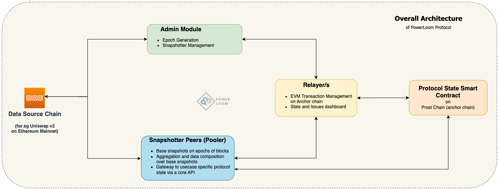
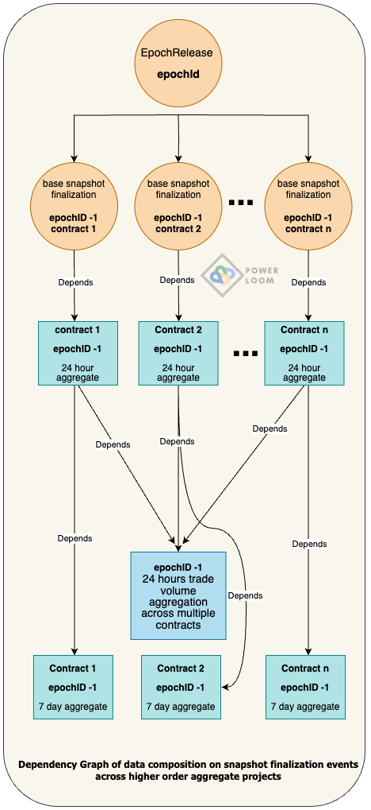
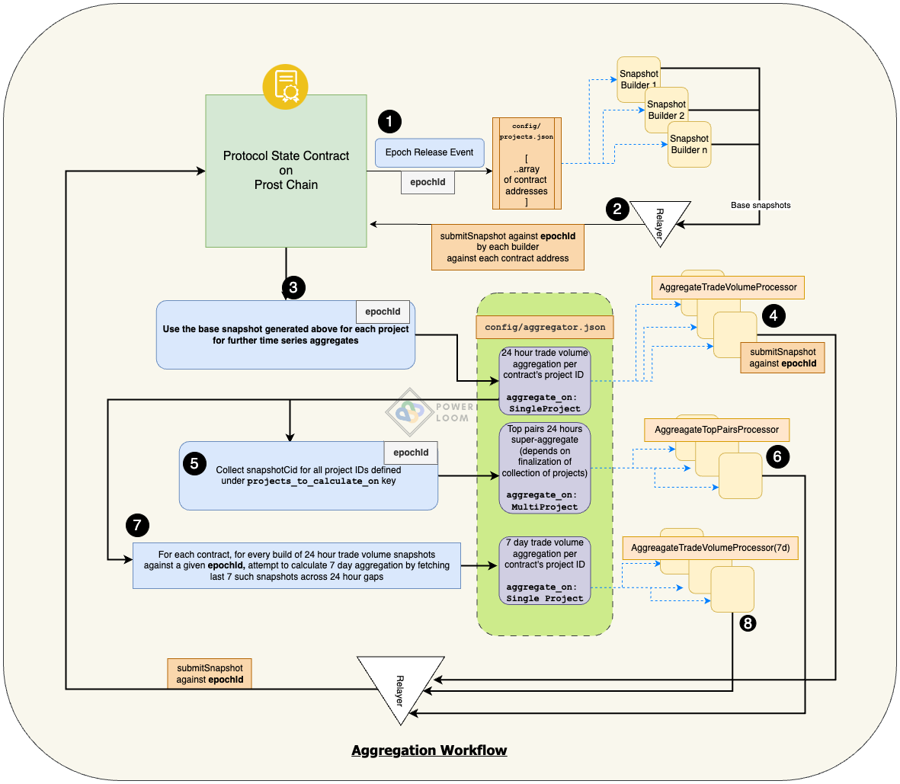
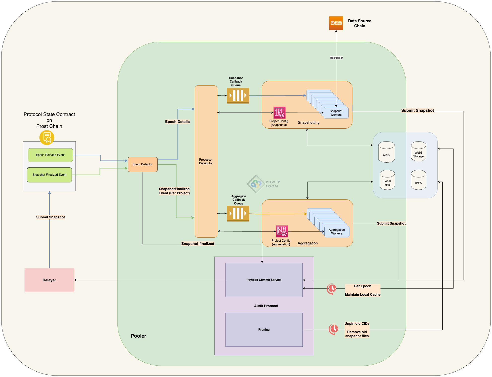

## Table of Contents
- [Table of Contents](#table-of-contents)
- [Overview](#overview)
- [Setup](#setup)
- [State transitions and data composition](#state-transitions-and-data-composition)
  - [Epoch Generation](#epoch-generation)
  - [Base Snapshot Generation](#base-snapshot-generation)
  - [Snapshot Finalization](#snapshot-finalization)
  - [Aggregation and data composition - snapshot generation](#aggregation-and-data-composition---snapshot-generation)
- [Development Instructions](#development-instructions)
  - [Configuration](#configuration)
- [Monitoring and Debugging](#monitoring-and-debugging)
- [For Contributors](#for-contributors)
- [Extending pooler with a Uniswap v2 data point](#extending-pooler-with-a-uniswap-v2-data-point)
  - [Review: Base snapshot extraction logic for trade information](#review-base-snapshot-extraction-logic-for-trade-information)
  - [Review: 24 hour aggregate of trade volume snapshots over a single pair contract](#review-24-hour-aggregate-of-trade-volume-snapshots-over-a-single-pair-contract)
  - [New Datapoint: 2 hours aggregate of only swap events](#new-datapoint-2-hours-aggregate-of-only-swap-events)
- [Major Components](#major-components)
  - [System Event Detector](#system-event-detector)
  - [Process Hub Core](#process-hub-core)
  - [Processor Distributor](#processor-distributor)
  - [Callback Workers](#callback-workers)
  - [RPC Helper](#rpc-helper)
- [Find us](#find-us)

## Overview




Pooler is a Uniswap specific implementation of what is known as a 'snapshotter' in the PowerLoom Protocol ecosystem. It synchronizes with other snapshotter peers over a smart contract running on the present version of the PowerLoom Protocol testnet. It follows an architecture that is driven by state transitions which makes it easy to understand and modify. This present release ultimately provide access to rich aggregates that can power a Uniswap v2 dashboard with the following data points:

- Total Value Locked (TVL)
- Trade Volume, Liquidity reserves, Fees earned
    - grouped by
        - Pair contracts
        - Individual tokens participating in pair contract
    - aggregated over time periods
        - 24 hours
        - 7 days
- Transactions containing `Swap`, `Mint`, and `Burn` events


In its last release (link to github commit or tag here), pooler was a *self contained* system that would provide access to the above. The present implementation differs from that in some major ways:

* each data point is calculated, updated and synchronized with other snapshotter peers participating in the network for this Uniswap v2 use case
* synchronization of data points is defined as a function of an epoch ID(entifier) where epoch refers to an equally spaced collection of blocks on the data source smart contract's chain (Ethereum mainnet in case of Uniswap v2). This simplifies building of use cases that are stateful (i.e. can be accessed according to their state at a given height of the data source chain), synchronized and depend on reliable data. For example,
    * dashboards by offering higher order aggregate datapoints
    * trading strategies and bots
* a snapshotter peer can now load past epochs, indexes and aggregates from a decentralized state and have access to a rich history of data
    * earlier a stand alone node would have differing aggregate datapoints from other such nodes running independently, and even though the datasets were decentralized on IPFS/Filecoin, the power of these decentralized storage networks could not be leveraged fully since the content identifiers would often be different without any coordinating pivot like a decentralized state or smart contract on which all peers had to agree.


## Setup

Pooler is part of a distributed system with multiple moving parts. The easiest way to get started is by using the docker-based setup from the [deploy](https://github.com/PowerLoom/deploy) repository.

If you're planning to participate as a snapshotter, refer to [these instructions](https://github.com/PowerLoom/deploy#for-snapshotters) to start snapshotting.

If you're a developer, you can follow the [manual configuration steps for pooler](#configuration) from this document followed by the [instructions on the `deploy` repo for code contributors](https://github.com/PowerLoom/deploy#instructions-for-code-contributors) for a more hands on approach.

**Note** - RPC usage is highly use case specific. If your use case is complicated and needs to make a lot of RPC calls, it is recommended to run your own RPC node instead of using third party RPC services as it can be expensive.

## State transitions and data composition

### Epoch Generation

An epoch denotes a range of block heights on the data source blockchain, Ethereum mainnet in the case of Uniswap v2. This makes it easier to collect state transitions and snapshots of data on equally spaced block height intervals, as well as to support future work on other lightweight anchor proof mechanisms like Merkle proofs, succinct proofs, etc.

The size of an epoch is configurable. Let that be referred to as `size(E)`

- A trusted service keeps track of the head of the chain as it moves ahead, and a marker `h₀` against the max block height from the last released epoch. This makes the beginning of the next epoch, `h₁ = h₀ + 1`

- Once the head of the chain has moved sufficiently ahead so that an epoch can be published, an epoch finalization service takes into account the following factors
    - chain reorganization reports where the reorganized limits are a subset of the epoch qualified to be published
    - a configurable ‘offset’ from the bleeding edge of the chain

 and then publishes an epoch `(h₁, h₂)` by sending a transaction to the protocol state smart contract deployed on the Prost Chain (anchor chain) so that `h₂ - h₁ + 1 == size(E)`. The next epoch, therefore, is tracked from `h₂ + 1`.

 Each such transaction emits an `EpochReleased` event 

 ```
 event EpochReleased(uint256 indexed epochId, uint256 begin, uint256 end, uint256 timestamp);
 ```

 The `epochId` here is incremented by 1 with every successive epoch release.

 ### Base Snapshot Generation

 Workers in [`config/projects.json`](config/projects.example.json) calculate base snapshots against this `epochId` which corresponds to collections of state observations and event logs between the blocks at height in the range `[begin, end]`, per Uniswap v2 pair contract. Each such pair contract is assigned a project ID on the protocol state contract according to the following format:

`{project_type}:{pair_contract_address}:{settings.namespace}`
 
 The snapshots generated by workers defined in this config are the fundamental data models on which higher order aggregates and richer datapoints are built.

 ### Snapshot Finalization

All snapshots per project reach consensus on the protocol state contract which results in a `SnapshotFinalized` event being triggered. 

This helps us in building sophisticated aggregates, super-aggregates, filters and other forms of data composition on top of base snapshots. 

```
event SnapshotFinalized(uint256 indexed epochId, uint256 epochEnd, string projectId, string snapshotCid, uint256 timestamp);
```

### Aggregation and data composition - snapshot generation

Workers as defined in `config/aggregator.json` are triggered by the appropriate signals forwarded to [`Processor Distributor`](pooler/processor_distributor.py) corresponding to the project ID filters as explained in the [Configuration](#configuration) section.







## Development Instructions
These instructions are needed if you're planning to run the system using `build-dev.sh` from [deploy](https://github.com/PowerLoom/deploy).

### Configuration
Pooler needs the following config files to be present
* **`settings.json` in `pooler/auth/settings`**: Changes are trivial. Copy [`config/auth_settings.example.json`](config/auth_settings.example.json) to `config/auth_settings.json`. This enables an authentication layer over the core API exposed by the pooler snapshotter.
* settings files in `config/`
    * **`config/projects.json`**: This lists out the smart contracts on the data source chain on which snapshots will be generated paired with the snapshot worker class. It's an array of objects with the following structure:
        ```javascript
        {
            "project_type": "snapshot_project_name_prefix_",
            "projects": ["array of smart contract addresses"], // Uniswap v2 pair contract addresses in this implementation
            "processor":{
                "module": "pooler.modules.uniswapv2.pair_total_reserves", 
                "class_name": "PairTotalReservesProcessor" // class to be found in module pooler/modules/uniswapv2/pair_total_reserves.py
            }
        }
        ```
        Copy over [`config/projects.example.json`](config/projects.example.json) to `config/projects.json`. For more details, read on in the [section below on extending a use case](#configuring-poolersettingssettingsjson).
    * **`config/aggregator.json`** : This lists out different type of aggregation work to be performed over a span of snapshots. Copy over [`config/aggregator.example.json`](config/aggregator.example.json) to `config/aggregator.json`. The span is usually calculated as a function of the epoch size and average block time on the data source network. For eg, 
        * the following configuration calculates a snapshot of total trade volume over a 24 hour time period, based on the [snapshot finalization](#snapshot-finalization) of a project ID corresponding to a pair contract. This can be seen by the `aggregate_on` key being set to `SingleProject`.
            * This is specified by the `filters` key below. If a [snapshot finalization](#snapshot-finalization) is achieved for an epoch over a project ID [(ref:generation of project ID for snapshot building workers)](#epoch-generation) `uniswap_pairContract_trade_volume:0xb4e16d0168e52d35cacd2c6185b44281ec28c9dc:UNISWAPV2-ph15-prod`, this would trigger the worker [`AggreagateTradeVolumeProcessor`](pooler/modules/uniswapv2/aggregate/single_uniswap_trade_volume_24h.py) as defined in the `processor` section of the config against the pair contract `0xb4e16d0168e52d35cacd2c6185b44281ec28c9dc`. 
        ```javascript
        {
            "config": [
                {
                    "project_type": "aggregate_uniswap_pairContract_24h_trade_volume",
                    "aggregate_on": "SingleProject",
                    "filters": {
                        // this triggers the compute() contained in the processor class at the module location
                        // every time a `SnapshotFinalized` event is received for project IDs containing the prefix `uniswap_pairContract_trade_volume`
                        // at each epoch ID
                        "projectId": "uniswap_pairContract_trade_volume"
                    },
                    "processor": {
                        "module": "pooler.modules.uniswapv2.aggregate.single_uniswap_trade_volume_24h",
                        "class_name": "AggreagateTradeVolumeProcessor"
                    }
                }
            ]
        }
        ```
        * The following configuration generates a collection of data sets of 24 hour trade volume as calculated by the worker above across multiple pair contracts. This can be seen by the `aggregate_on` key being set to `MultiProject`.
            * `projects_to_wait_for` specifies the exact project IDs on which this collection will be generated once a [snapshot finalized event](#snapshot-finalization) has been received for an [`epochId`](#epoch-generation). 
        ```javascript
        {
            "config": [
                "project_type": "aggregate_uniswap_24h_top_pairs",
                "aggregate_on": "MultiProject",
                "projects_to_wait_for": [
                    // this triggers the compute() contained in the processor class at the module location
                    // after `SnapshotFinalized` events are received for project IDs containing the prefix `uniswap_pairContract_trade_volume`
                    "aggregate_uniswap_pairContract_24h_trade_volume:0xa478c2975ab1ea89e8196811f51a7b7ade33eb11:UNISWAPV2-ph15-prod",
                    "uniswap_pairContract_pair_total_reserves:0xa478c2975ab1ea89e8196811f51a7b7ade33eb11:UNISWAPV2-ph15-prod",
                    "aggregate_uniswap_pairContract_24h_trade_volume:0x11181bd3baf5ce2a478e98361985d42625de35d1:UNISWAPV2-ph15-prod",
                    "uniswap_pairContract_pair_total_reserves:0x11181bd3baf5ce2a478e98361985d42625de35d1:UNISWAPV2-ph15-prod"
                ],
                "processor": {
                    "module": "pooler.modules.uniswapv2.aggregate.multi_uniswap_top_pairs_24h",
                    "class_name": "AggreagateTopPairsProcessor"
                }
            ]
        }
        ```

    * To begin with, you can keep the workers and contracts as specified in the example files.

    * **`config/settings.json`**: This is the primary configuration. We've provided a settings template in `config/settings.example.json` to help you get started. Copy over [`config/settings.example.json`](config/settings.example.json) to `config/settings.json`. There can be a lot to fine tune but the following are essential.
        - `instance_id`: This is the unique public key for your node to participate in consensus. It is currently registered on approval of an application (refer [deploy](https://github.com/PowerLoom/deploy) repo for more details on applying).
        - `namespace`, it is the unique key used to identify your project namespace around which all consensus activity takes place.
        - RPC service URL(s) and rate limit configurations. Rate limits are service provider specific, different RPC providers have different rate limits. Example rate limit config for a node looks something like this `"100000000/day;20000/minute;2500/second"`
            - **`rpc.full_nodes`**: This will correspond to RPC nodes for the chain on which the data source smart contracts lives (for eg. Ethereum Mainnet, Polygon Mainnet etc). 
            - **`anchor_chain_rpc.full_nodes`**: This will correspond to RPC nodes for the anchor chain on which the protocol state smart contract lives (Prost Chain). 
            - **`protocol_state.address`** : This will correspond to the address at which the protocol state smart contract is deployed on the anchor chain. **`protocol_state.abi`** is already filled in the example and already available at the static path specified [`pooler/static/abis/ProtocolContract.json`](pooler/static/abis/ProtocolContract.json)
    

## Monitoring and Debugging
Login to pooler docker container using `docker exec -it deploy-pooler-1 bash` (use `docker ps` to verify its presence in the list of running containers) and use the following commands for monitoring and debugging
- To monitor the status of running processes, you simply need to run `pm2 status`.
- To see all logs you can run `pm2 logs`
- To see logs for a specific process you can run `pm2 logs <Process Identifier>`
- To see only error logs you can run `pm2 logs --err`

## For Contributors
We use [pre-commit hooks](https://pre-commit.com/) to ensure our code quality is maintained over time. For this contributors need to do a one-time setup by running the following commands.
* Install the required dependencies using `pip install -r dev-requirements.txt`, this will setup everything needed for pre-commit checks.
* Run `pre-commit install`

Now, whenever you commit anything, it'll automatically check the files you've changed/edited for code quality issues and suggest improvements.


## Extending pooler with a Uniswap v2 data point

In this section, let us take a look at the data composition abilities of Pooler to build on the base snapshot being built that captures information on Uniswap trades. 

### Review: Base snapshot extraction logic for trade information

Required reading: 
* [Base Snapshot Generation](#base-snapshot-generation) and 
* [configuring `config/projects.json`](#configuration)

As you can notice in [`config/projects.example.json`](config/projects.example.json), each project config needs to have the following components

- `project_type` (unique identifier prefix for the usecase, [used to generate project ID](#base-snapshot-generation))
- `projects` (smart contracts to extract data from, pooler can generate different snapshots from multiple sources as long as the Contract ABI is same)
- `processor` (the actual compuation logic reference, while you can write the logic anywhere, it is recommended to write your implementation in pooler/modules folder)

There's currently no limitation on the number or type of usecases you can build using pooler. Just write the Processor class and pooler libraries will take care of the rest.

https://github.com/PowerLoom/pooler/blob/1452c166bef7534568a61b3a2ab0ff94535d7229/config/projects.example.json#L1-L35


If we take a look at the `TradeVolumeProcessor` class present at [`pooler/modules/uniswapv2/trade_volume.py`](pooler/modules/uniswapv2/trade_volume.py) it implements the interface of `GenericProcessorSnapshot` defined in [`pooler/utils/callback_helpers.py`](pooler/utils/callback_helpers.py).


https://github.com/PowerLoom/pooler/blob/1452c166bef7534568a61b3a2ab0ff94535d7229/pooler/modules/uniswapv2/trade_volume.py#L13-L86


There are a couple of important concepts here necessary to write your extraction logic:
1. `compute` is the main function where most of the snapshot extraction and generation logic needs to be written. It receives the following inputs:
- `max_chain_height` (epoch end block)
- `min_chain_height` (epoch start block)
- `data_source_contract_address` (contract address to extract data from)
- `redis` (async redis connection)
- `rpc_helper` ([`RpcHelper`](pooler/utils/rpc.py) instance to help with any calls to the data source contract's chain)

2. `transformation_lambdas` provide an additional layer for computation on top of the generated snapshot (if needed). If `compute` function handles everything you can just set `transformation_lambdas` to `[]` otherwise pass the list of transformation function sequence. Each function referenced in `transformation_lambdas` must have same input interface. It should receive the following inputs -
 - `snapshot` (the generated snapshot to apply transformation on)
 - `data_source_contract_address` (contract address to extract data from)
 - `epoch_begin` (epoch begin block)
 - `epoch_end` (epoch end block)

Output format can be anything depending on the usecase requirements. Although it is recommended to use proper [`pydantic`](https://pypi.org/project/pydantic/) models to define the snapshot interface.

The resultant output model in this specific example is `UniswapTradesSnapshot` as defined in the Uniswap v2 specific modules directory: [`utils/models/message_models.py`](pooler/modules/uniswapv2/utils/models/message_models.py). This encapsulates state information captured by `TradeVolumeProcessor` between the block heights of the epoch: `min_chain_height` and `max_chain_height`.

https://github.com/PowerLoom/pooler/blob/1452c166bef7534568a61b3a2ab0ff94535d7229/pooler/modules/uniswapv2/utils/models/message_models.py#L37-L44


### Review: 24 hour aggregate of trade volume snapshots over a single pair contract

* As demonstrated in the previous section, the `TradeVolumeProcessor` logic takes care of capturing a snapshot of information regarding Uniswap v2 trades between the block heights of `min_chain_height` and `max_chain_height`. 

* The epoch size as described in the prior section on [epoch generation](#epoch-generation) can be considered to be constant for this specific implementation of the Uniswap v2 use case on PowerLoom Protocol, and by extension, the time duration captured within the epoch. 

* As shown in the section on [dependency graph of data composition](#aggregation-and-data-composition---snapshot-generation), every aggregate is calculated relative to the `epochId` at which the dependee [`SnapshotFinalized` event](#snapshot-finalization) is receieved.

* The finalized state and data CID corresponding to each epoch can be accessed on the smart contract on the anchor chain that holds the protocol state. The corresponding helpers for that can be found in `get_project_epoch_snapshot()` in [`pooler/utils/data_utils`](pooler/utils/data_utils.py)

https://github.com/PowerLoom/pooler/blob/1452c166bef7534568a61b3a2ab0ff94535d7229/pooler/utils/data_utils.py#L183-L191


* Considering the incoming `epochId` to be the head of the span, the quickest formula to arrive at the tail of the span of 24 hours worth of snapshots and trade information becomes,

```python
time_in_seconds = 86400
tail_epoch_id = current_epoch_id - int(time_in_seconds / (source_chain_epoch_size * source_chain_block_time))
```

https://github.com/PowerLoom/pooler/blob/1452c166bef7534568a61b3a2ab0ff94535d7229/pooler/utils/data_utils.py#L263-L290

* The worker class for such aggregation is defined in `config/aggregator.json` in the following manner

https://github.com/PowerLoom/pooler/blob/1452c166bef7534568a61b3a2ab0ff94535d7229/config/aggregator.example.json#L3-L10

* Each finalized `epochId` is registered with a snapshot commit against the aggregated data set generated by running summations on trade volumes on all the base snapshots contained within the span calculated above.

https://github.com/PowerLoom/pooler/blob/1452c166bef7534568a61b3a2ab0ff94535d7229/pooler/modules/uniswapv2/aggregate/single_uniswap_trade_volume_24h.py#L84-L157


### New Datapoint: 2 hours aggregate of only swap events

From the information provided above, the following is left as an exercise for the reader to generate aggregate datasets at every `epochId` finalization for a pair contract, spanning 2 hours worth of snapshots and containing only `Swap` event logs and the trade volume generated from them as a result.

> Feel free to fork this repo and commit these on your implementation branch. By following the steps recommended for developers for the overall setup on [`deploy`](https://github.com/powerloom/deploy), you can begin capturing aggregates for this datapoint.

* Add a new configuration entry in `config/aggregator.json` for this new aggregation worker class

* Define a new data model in [`utils/message_models.py`](pooler/modules/uniswapv2/utils/models/message_models.py) referring to 
    * `UniswapTradesAggregateSnapshot` as used in above example
    * `UniswapTradesSnapshot` used to capture each epoch's trade snapshots which includes the raw event logs as well

* Follow the example of the aggregator worker [as implemented for 24 hours aggregation calculation](pooler/modules/uniswapv2/aggregate/single_uniswap_trade_volume_24h.py) , and work on calculating an `epochId` span of 2 hours and filtering out only the `Swap` events and the trade volume contained within.

## Major Components



### System Event Detector

The system event detector tracks events being triggered on the protocol state contract running on the anchor chain and forwards it to a callback queue with the appropriate routing key depending on the event signature and type among other information.

Related information and other services depending on these can be found in previous sections: [State Transitions](#state-transitions), [Configuration](#configuration).


### Process Hub Core

The Process Hub Core, defined in [`process_hub_core.py`](pooler/process_hub_core.py), serves as the primary process manager in Pooler. 
* Operated by the CLI tol [`processhub_cmd.py`](pooler/processhub_cmd.py), it is responsible for starting and managing the `SystemEventDetector` and `ProcessorDistributor` processes. 
* Additionally, it spawns the base snapshot and aggregator workers required for processing tasks from the `powerloom-backend-callback` queue. The number of workers and their configuration path can be adjusted in `config/settings.json`.

### Processor Distributor
The Processor Distributor, defined in [`processor_distributor.py`](pooler/processor_distributor.py), is initiated using the `processhub_cmd.py` CLI. 

* It loads the base snapshotting and aggregator config information from settings
* It reads the events forwarded by the event detector to the `f'powerloom-event-detector:{settings.namespace}:{settings.instance_id}'` RabbitMQ queue bound to a topic exchange as configured in `settings.rabbitmq.setup.event_detector.exchange`([code-ref: RabbitMQ exchanges and queue setup in pooler](pooler/init_rabbitmq.py))
* It creates and distributes processing messages based on project configuration present in `config/projects.json` and `config/aggregator.json`, and the topic pattern used in the routing key received from the topic exchange
  * For [`EpochReleased` events](#epoch-generation), it forwards such messages to base snapshot builders for data source contracts as configured in `config/projects.json` for the current epoch information contained in the event.
    https://github.com/PowerLoom/pooler/blob/1452c166bef7534568a61b3a2ab0ff94535d7229/pooler/processor_distributor.py#L125-L141
  * For [`SnapshotFinalized` events](#snapshot-finalization), it forwards such messages to single and multi project aggregate topic routing keys.
    https://github.com/PowerLoom/pooler/blob/1452c166bef7534568a61b3a2ab0ff94535d7229/pooler/processor_distributor.py#L228-L303

### Callback Workers

The callback workers are basically the ones that build the base snapshot and aggregation snapshots and as explained above, are launched by the [processor distributor](#processor-distributor) according to the configurations in `aggregator/projects.json` and `config/aggregator.json`. They listen to new messages on the `powerloom-backend-callback` topic queue. Upon receiving a message, the workers do most of the heavy lifting along with some sanity checks and then calls the actual `compute` function defined in the project configuration to read blockchain state and generate the snapshot.

* [Base Snapshot builder](pooler/utils/snapshot_worker.py)
* [Aggregation Snapshot builder](pooler/utils/aggregation_worker.py)

### RPC Helper
Extracting data from blockchain state and generating the snapshot can be a complex task. The `RpcHelper`, defined in [`utils/rpc.py`](pooler/utils/rpc.py), has a bunch of helper functions to make this process easier. It handles all the `retry` and `caching` logic so that developers can focus on building their use cases in an efficient way.


## Find us

* [Discord](https://discord.gg/QCpVhshdtt)
* [Twitter](https://twitter.com/PowerLoomHQ)
* [Github](https://github.com/PowerLoom)
* [Careers](https://wellfound.com/company/powerloom/jobs)
* [Medium Engineering Blog](https://medium.com/powerloom)