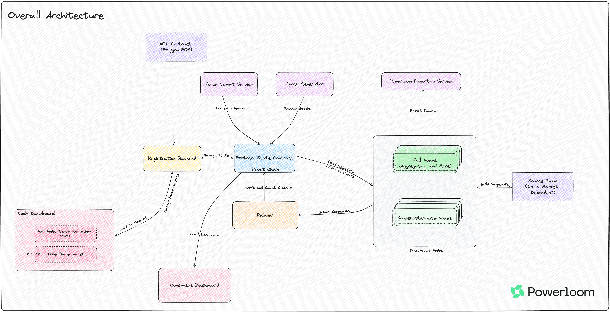
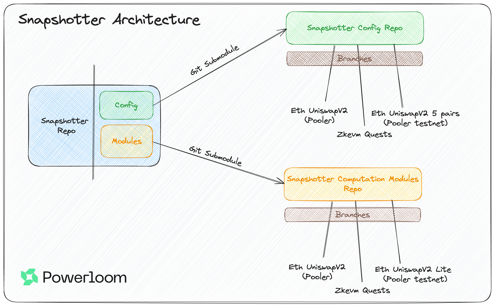

## Table of Contents
- [Table of Contents](#table-of-contents)
- [Overview](#overview)
  - [Architecture](#architecture)
- [Setup](#setup)
- [State transitions and data composition](#state-transitions-and-data-composition)
  - [Epoch Generation](#epoch-generation)
  - [Preloading](#preloading)
  - [Base Snapshot Generation](#base-snapshot-generation)
    - [Bulk Mode](#bulk-mode)
  - [Data source signaling](#data-source-signaling)
  - [Snapshot Finalization](#snapshot-finalization)
  - [Epoch processing state transitions](#epoch-processing-state-transitions)
    - [`EPOCH_RELEASED`](#epoch_released)
    - [`PRELOAD`](#preload)
    - [`SNAPSHOT_BUILD`](#snapshot_build)
    - [`SNAPSHOT_SUBMIT_PAYLOAD_COMMIT`](#snapshot_submit_payload_commit)
    - [`RELAYER_SEND`](#relayer_send)
    - [`SNAPSHOT_FINALIZE`](#snapshot_finalize)
  - [Aggregation and data composition - snapshot generation of higher-order data points on base snapshots](#aggregation-and-data-composition---snapshot-generation-of-higher-order-data-points-on-base-snapshots)
- [Major Components](#major-components)
  - [System Event Detector](#system-event-detector)
  - [Process Hub Core](#process-hub-core)
  - [Processor Distributor](#processor-distributor)
  - [Delegation Workers for preloaders](#delegation-workers-for-preloaders)
  - [Callback Workers](#callback-workers)
  - [RPC Helper](#rpc-helper)
  - [Core API](#core-api)
- [Development setup and instructions](#development-setup-and-instructions)
  - [Configuration](#configuration)
- [Monitoring and Debugging](#monitoring-and-debugging)
  - [Internal Snapshotter APIs](#internal-snapshotter-apis)
    - [`GET /internal/snapshotter/epochProcessingStatus`](#get-internalsnapshotterepochprocessingstatus)
    - [`GET /internal/snapshotter/status`](#get-internalsnapshotterstatus)
    - [`GET /internal/snapshotter/status/{project_id}`](#get-internalsnapshotterstatusproject_id)
    - [`GET /internal/snapshotter/status/{project_id}?data=true`](#get-internalsnapshotterstatusproject_iddatatrue)
- [For Contributors](#for-contributors)
- [Case Studies](#case-studies)
  - [1. Pooler: Case study and extending this implementation](#1-pooler-case-study-and-extending-this-implementation)
    - [Extending pooler with a Uniswap v2 data point](#extending-pooler-with-a-uniswap-v2-data-point)
      - [Step 1. Review: Base snapshot extraction logic for trade information](#step-1-review-base-snapshot-extraction-logic-for-trade-information)
      - [Step 2. Review: 24 hour aggregate of trade volume snapshots over a single pair contract](#step-2-review-24-hour-aggregate-of-trade-volume-snapshots-over-a-single-pair-contract)
      - [Step 3. New Datapoint: 2 hours aggregate of only swap events](#step-3-new-datapoint-2-hours-aggregate-of-only-swap-events)
  - [2. Zkevm Quests: A Case Study of Implementation](#2-zkevm-quests-a-case-study-of-implementation)
    - [Review: Base snapshots](#review-base-snapshots)
    - [`zkevm:bungee_bridge`](#zkevmbungee_bridge)
- [Find us](#find-us)

## Overview



A snapshotter peer as part of Powerloom Protocol does exactly what the name suggests:  It synchronizes with other snapshotter peers over a smart contract running on Powerloom Prost chain. It follows an architecture that is driven by state transitions which makes it easy to understand and modify.

Because of its decentralized nature, the snapshotter specification and its implementations share some powerful features that can adapt to your specific information requirements on blockchain applications:

* Each data point is calculated, updated, and synchronized with other snapshotter peers participating in the network
* synchronization of data points is defined as a function of an epoch ID(identifier) where epoch refers to an equally spaced collection of blocks on the data source blockchain (for eg, Ethereum Mainnet/Polygon Mainnet/Polygon Testnet -- Mumbai). This simplifies the building of use cases that are stateful (i.e. can be accessed according to their state at a given height of the data source chain), synchronized, and depend on reliable data. For example,
    * dashboards by offering higher-order aggregate datapoints
    * trading strategies and bots
* a snapshotter peer can load past epochs, indexes, and aggregates from a decentralized state and have access to a rich history of data
    * all the datasets are decentralized on IPFS/Filecoin
    * the power of these decentralized storage networks can be leveraged fully by applying the [principle of composability](#aggregation-and-data-composition---snapshot-generation-of-higher-order-datapoints-on-base-snapshots)

### Architecture

The Snapshotter Peer is thoughtfully designed with a modular and highly configurable architecture, allowing for easy customization and seamless integration. It consists of three core components:

1. **Main Snapshotter Codebase**:
   - This foundational component defines all the essential interfaces and handles a wide range of tasks, from listening to epoch release events to distributing tasks and managing snapshot submissions.

2. **Configuration Files**:
   - Configuration files, located in the `/config` directory are linked to [snapshotter-configs](https://github.com/PowerLoom/snapshotter-configs/) repo, play a pivotal role in defining project types, specifying paths for individual compute modules, and managing various project-related settings.

3. **Compute Modules**:
   - The heart of the system resides in the `snapshotter/modules` directory are linked to [snapshotter-computes](https://github.com/PowerLoom/snapshotter-computes/), where the actual computation logic for each project type is defined. These modules drive the snapshot generation process for specific project types.



The architecture has been designed to facilitate the seamless interchange of configuration and modules. To achieve this, we maintain these components in separate Git repositories, which are then integrated into the Snapshotter Peer using Git Submodules. As a result, adapting the system to different use cases is as straightforward as changing a Git branch, offering unparalleled flexibility and versatility.

For more information on using Git Submodules, please refer to the [Git Submodules Documentation](https://git-scm.com/book/en/v2/Git-Tools-Submodules).

## Setup

The snapshotter is a distributed system with multiple moving parts. The easiest way to get started is by using the Docker-based setup according to the instructions in the section: [Development setup and instructions](#development-setup-and-instructions).

If you're planning to participate as a snapshotter, refer to [these instructions](https://github.com/PowerLoom/deploy#for-snapshotters) to start snapshotting.

If you're a developer, you can follow the [manual configuration steps for pooler](#configuration) from this document followed by the [instructions on the `deploy` repo for code contributors](https://github.com/PowerLoom/deploy#instructions-for-code-contributors) for a more hands-on approach.

**Note** - RPC usage is highly use-case specific. If your use case is complicated and needs to make a lot of RPC calls, it is recommended to run your own RPC node instead of using third-party RPC services as it can be expensive.


## State transitions and data composition


### Epoch Generation

An epoch denotes a range of block heights on the EVM-compatible data source blockchain, for eg Ethereum mainnet/Polygon PoS mainnet/testnet. This makes it easier to collect state transitions and snapshots of data on equally spaced block height intervals, as well as to support future work on other lightweight anchor proof mechanisms like Merkle proofs, succinct proofs, etc.

The size of an epoch is configurable. Let that be referred to as `size(E)`

- A [trusted service](https://github.com/PowerLoom/onchain-consensus) keeps track of the head of the chain as it moves ahead, and a marker `h₀` against the max block height from the last released epoch. This makes the beginning of the next epoch, `h₁ = h₀ + 1`

- Once the head of the chain has moved sufficiently ahead so that an epoch can be published, an epoch finalization service takes into account the following factors
    - chain reorganization reports where the reorganized limits are a subset of the epoch qualified to be published
    - a configurable ‘offset’ from the bleeding edge of the chain

 and then publishes an epoch `(h₁, h₂)` by sending a transaction to the protocol state smart contract deployed on the Prost Chain (anchor chain) so that `h₂ - h₁ + 1 == size(E)`. The next epoch, therefore, is tracked from `h₂ + 1`.

 Each such transaction emits an `EpochReleased` event

 ```
 event EpochReleased(uint256 indexed epochId, uint256 begin, uint256 end, uint256 timestamp);
 ```

 The `epochId` here is incremented by 1 with every successive epoch release.


 ### Preloading

Preloaders perform an important function of fetching low-level data for eg. block details, and transaction receipts so that subsequent base snapshot building can proceed without performing unnecessary redundant calls that ultimately save on access costs on RPC and other queries on the underlying node infrastructure for the source data blockchain.

Each project type within the project configuration as found in [`config/projects.json`](https://github.com/PowerLoom/snapshotter-configs/blob/f46cc86cd08913014decf7bced128433442c8f84/projects.example.json) can specify the preloaders that their base snapshot builds depend on. Once the dependent preloaders have completed their fetches, the [Processor Distributor](#processor-distributor) subsequently triggers the base snapshot builders for each project type.

https://github.com/PowerLoom/pooler/blob/5e7cc3812074d91e8d7d85058554bb1175bf8070/config/projects.example.json#L2-L8

The preloaders implement one of the following two generic interfaces

* `GenericPreloader`

https://github.com/PowerLoom/pooler/blob/5e7cc3812074d91e8d7d85058554bb1175bf8070/snapshotter/utils/callback_helpers.py#L109-L126

* `GenericDelegatorPreloader`. Such preloaders are tasked with fetching large volumes of data and utilize [delegated workers](#delegation-workers-for-preloaders) to which they submit large workloads over a request queue and wait for the results to be returned over a response queue.

https://github.com/PowerLoom/pooler/blob/5e7cc3812074d91e8d7d85058554bb1175bf8070/snapshotter/utils/callback_helpers.py#L129-L161


The preloaders can be found in the [`snapshotter/utils/preloaders`](snapshotter/utils/preloaders/) directory. The preloaders that are available to project configuration entries are exposed through the [`config/preloader.json`](https://github.com/PowerLoom/snapshotter-configs/blob/f46cc86cd08913014decf7bced128433442c8f84/preloader.json) configuration.

https://github.com/PowerLoom/pooler/blob/5e7cc3812074d91e8d7d85058554bb1175bf8070/config/preloader.json#L1-L27

At the moment, we have 3 generic preloaders built into the snapshotter template.
- [Block Details](snapshotter/utils/preloaders/block_details/preloader.py) - It prefetches and stores block details for blocks in each Epoch and stores it in Redis
- [Eth Price](snapshotter/utils/preloaders/eth_price/preloader.py) - It prefetches and stores ETH price for blocks in each Epoch and stores it in redis
- [Tx Receipts](snapshotter/utils/preloaders/tx_receipts/preloader.py) - It prefetches all transaction details present in each Epoch and stores the data in Redis. Since fetching all block transactions is a lot of work, it utilizes the [delegated workers](#delegation-workers-for-preloaders) architecture to parallelize and fetch data in a fast and reliable way

More preloaders can be easily added depending on the use case user is snapshotting for. It is as simple as writing logic in `preloader.py`, adding the preloader config to `config/preloader.json`, and adding the preloader dependency in `config/projects.json`

 ### Base Snapshot Generation

 Workers, as mentioned in the configuration section for [`config/projects.json`](#configuration), calculate base snapshots against this `epochId` which corresponds to collections of state observations and event logs between the blocks at height in the range `[begin, end]`.

 The data sources are determined according to the following specification for the `projects` key:

 * an empty array against the `projects` indicates no specific data source is defined
 * an array of EVM-compatible wallet address strings can also be listed
 * an array of "<addr1>_<addr2>" strings that denote the relationship between two EVM addresses (for eg ERC20 balance of `addr2` against a token contract `addr1`)
 * data sources can be dynamically added on the protocol state contract which the [processor distributor](#processor-distributor) [syncs with](https://github.com/PowerLoom/pooler/blob/d8b7be32ad329e8dcf0a7e5c1b27862894bc990a/snapshotter/processor_distributor.py#L1107):

The project ID is ultimately generated in the following manner:

https://github.com/PowerLoom/pooler/blob/d8b7be32ad329e8dcf0a7e5c1b27862894bc990a/snapshotter/utils/snapshot_worker.py#L51-L71


 The snapshots generated by workers defined in this config are the fundamental data models on which higher-order aggregates and richer data points are built. The `SnapshotSubmitted` event generated on such base snapshots further triggers the building of sophisticated aggregates, super-aggregates, filters, and other data composites on top of them.

#### Bulk Mode

For situations where data sources are constantly changing or numerous, making it impractical to maintain an extensive list of them, the Snapshotter Peer offers a Bulk Mode. This feature is particularly useful in scenarios where specific data sources need not be defined explicitly.

In Bulk Mode, the system monitors all transactions and blocks without the need for predefined data sources. The Processor Distributor generates a `SnapshotProcessMessage` with bulk mode enabled for each project type. When snapshot workers receive this message, they leverage preloaded transaction receipts for entire blocks, filtering out relevant transactions to generate snapshots for all data sources that interacted with the blockchain during that epoch. Snapshot worker then generates relevant project Ids for these snapshots and submits them for further processing.

Bulk Mode is highly effective in situations where the project list is continually expanding or where snapshots don't need to be submitted in every epoch, perhaps because the data hasn't changed significantly. Example use cases include monitoring on-chain activities and tracking task or quest completion statuses on the blockchain.

An important advantage of Bulk Mode is that, since all transaction receipts are preloaded, this approach can efficiently scale to accommodate a large number of project types with little to no increase in RPC (Remote Procedure Call) calls.

https://github.com/PowerLoom/pooler/blob/d8b7be32ad329e8dcf0a7e5c1b27862894bc990a/snapshotter/utils/snapshot_worker.py#L260-L299

 ### Data source signaling

 As seen above in the section on [base snapshot generation](#base-snapshot-generation), data sources can be dynamically added to the contract according to the role of certain peers in the ecosystem known as 'signallers'. This is the most significant aspect of the Powerloom Protocol ecosystem apart from snapshotting and will soon be decentralized to factor in on-chain activity, and market forces and accommodate a demand-driven, dynamic data ecosystem.

In the existing setup, when the `project_type` is set to an empty array (`[]`) and bulk mode is not activated, the snapshotter node attempts to retrieve data sources corresponding to the `projects` key from the protocol state contract.

Whenever a data source is added or removed by a combination of the data source-detector and signaller, the protocol state smart contract emits a `ProjectUpdated` event, adhering to the defined data model.

https://github.com/PowerLoom/pooler/blob/5892eeb9433d8f4b8aa677006d98a1dde0458cb7/snapshotter/utils/models/data_models.py#L102-L105

The snapshotting for every such dynamically added project is initiated only when the `epochId`, corresponding to the field `enableEpochId` contained within the `ProjectUpdated` event, is released. The [processor distributor](#processor-distributor) correctly triggers the snapshotting workflow for such dynamically added data sources in the following segment:

https://github.com/PowerLoom/pooler/blob/d8b7be32ad329e8dcf0a7e5c1b27862894bc990a/snapshotter/processor_distributor.py#L765-L796


 ### Snapshot Finalization

All snapshots per project reach consensus on the protocol state contract which results in a `SnapshotFinalized` event being triggered.

```
event SnapshotFinalized(uint256 indexed epochId, uint256 epochEnd, string projectId, string snapshotCid, uint256 timestamp);
```

### Epoch processing state transitions

The following is a sequence of states that an epoch goes through from the point epoch is released until `SnapshotFinalized` event is received by the processor distributor for the specific epoch. These state transitions can be inspected in detail as noted in the section on [internal snapshotter APIs](#internal-snapshotter-apis).

---

#### `EPOCH_RELEASED`

The state name is self explanatory.


#### `PRELOAD`

For every [project type's preloader specifications](https://github.com/PowerLoom/pooler/blob/bcc245d228acce504ba803b9b50fd89c8eb05984/README.md#preloading), the status of all the preloading dependencies being satisfied is captured here:

https://github.com/PowerLoom/pooler/blob/bcc245d228acce504ba803b9b50fd89c8eb05984/snapshotter/processor_distributor.py#L227-L251

#### `SNAPSHOT_BUILD`

The snapshot builders as configured in [`projects.json`](https://github.com/PowerLoom/pooler/blob/56c3dd71b5ec0abf58db3407ef3539f3457076f5/README.md#base-snapshot-generation) are executed. Also refer to the [case study of the current implementation of Pooler](https://github.com/PowerLoom/pooler/blob/56c3dd71b5ec0abf58db3407ef3539f3457076f5/README.md#1-pooler-case-study-and-extending-this-implementation) for a detailed look at snapshot building for base as well as aggregates.


https://github.com/PowerLoom/pooler/blob/bcc245d228acce504ba803b9b50fd89c8eb05984/snapshotter/utils/snapshot_worker.py#L100-L120

#### `SNAPSHOT_SUBMIT_PAYLOAD_COMMIT`

Captures the status of  propagation of the built snapshot to the [payload commit service in Audit Protocol](https://github.com/PowerLoom/audit-protocol/blob/1d8b1ae0789ba3260ddb358231ac4b597ec8a65f/docs/Introduction.md#payload-commit-service) for further submission to the protocol state contract.

https://github.com/PowerLoom/pooler/blob/bcc245d228acce504ba803b9b50fd89c8eb05984/snapshotter/utils/generic_worker.py#L166-L195


#### `RELAYER_SEND`

Payload commit service has sent the snapshot to a transaction relayer to submit to the protocol state contract.


#### `SNAPSHOT_FINALIZE`

[Finalized snapshot](https://github.com/PowerLoom/pooler/blob/56c3dd71b5ec0abf58db3407ef3539f3457076f5/README.md#snapshot-finalization) accepted against an epoch via a `SnapshotFinalized` event.

https://github.com/PowerLoom/pooler/blob/bcc245d228acce504ba803b9b50fd89c8eb05984/snapshotter/processor_distributor.py#L475-L482

### Aggregation and data composition - snapshot generation of higher-order data points on base snapshots

Workers as defined in `config/aggregator.json` are triggered by the appropriate signals forwarded to [`Processor Distributor`](pooler/processor_distributor.py) corresponding to the project ID filters as explained in the [Configuration](#configuration) section. This is best seen in action in Pooler, the snapshotter implementation that serves multiple aggregated data points for Uniswap v2 trade information.


In case of aggregation over multiple projects, their project IDs are generated with a combination of the hash of the dependee project IDs along with the namespace

https://github.com/PowerLoom/pooler/blob/d8b7be32ad329e8dcf0a7e5c1b27862894bc990a/snapshotter/utils/aggregation_worker.py#L59-L112

## Major Components


### System Event Detector

The system event detector tracks events being triggered on the protocol state contract running on the anchor chain and forwards it to a callback queue with the appropriate routing key depending on the event signature and type among other information.

Related information and other services depending on these can be found in previous sections: [State Transitions](#state-transitions), [Configuration](#configuration).


### Process Hub Core

The Process Hub Core, defined in [`process_hub_core.py`](snapshotter/process_hub_core.py), serves as the primary process manager in the snapshotter.
* Operated by the CLI tool [`processhub_cmd.py`](snapshotter/processhub_cmd.py), it is responsible for starting and managing the `SystemEventDetector` and `ProcessorDistributor` processes.
* Additionally, it spawns the base snapshot and aggregator workers required for processing tasks from the `powerloom-backend-callback` queue. The number of workers and their configuration path can be adjusted in `config/settings.json`.

### Processor Distributor
The Processor Distributor, defined in [`processor_distributor.py`](snapshotter/processor_distributor.py), is initiated using the `processhub_cmd.py` CLI.

* It loads the preloader, base snapshotting, and aggregator config information from the settings file
* It reads the events forwarded by the event detector to the `f'powerloom-event-detector:{settings.namespace}:{settings.instance_id}'` RabbitMQ queue bound to a topic exchange as configured in `settings.rabbitmq.setup.event_detector.exchange`([code-ref: RabbitMQ exchanges and queue setup in pooler](snapshotter/init_rabbitmq.py))
* It creates and distributes processing messages based on the preloader configuration present in `config/preloader.json`, the project configuration present in `config/projects.json` and `config/aggregator.json`, and the topic pattern used in the routing key received from the topic exchange
  * For [`EpochReleased` events](#epoch-generation), it forwards such messages to base snapshot builders for data source contracts as configured in `config/projects.json` for the current epoch information contained in the event.
    https://github.com/PowerLoom/pooler/blob/d8b7be32ad329e8dcf0a7e5c1b27862894bc990a/snapshotter/processor_distributor.py#L694-L810
  * For [`SnapshotSubmitted` events](#base-snapshot-generation), it forwards such messages to single and multi-project aggregate topic routing keys.
    https://github.com/PowerLoom/pooler/blob/d8b7be32ad329e8dcf0a7e5c1b27862894bc990a/snapshotter/processor_distributor.py#L928-L1042


### Delegation Workers for preloaders

The preloaders often fetch and cache large volumes of data, for eg, all the transaction receipts for a block on the data source blockchain. In such a case, a single worker will never be enough to feasibly fetch the data for a timely base snapshot generation and subsequent aggregate snapshot generations to finally reach a consensus.

Hence such workers are defined as `delegate_tasks` in [`config/preloader.json`](https://github.com/PowerLoom/snapshotter-configs/blob/f46cc86cd08913014decf7bced128433442c8f84/preloader.json) and the [process hub core](#process-hub-core) launches a certain number of workers as defined in the primary settings file, `config/settings.json` under the key `callback_worker_config.num_delegate_workers`.

https://github.com/PowerLoom/pooler/blob/5e7cc3812074d91e8d7d85058554bb1175bf8070/config/preloader.json#L19-L25

https://github.com/PowerLoom/pooler/blob/5e7cc3812074d91e8d7d85058554bb1175bf8070/config/settings.example.json#L86-L90

Delegation workers operate over a simple request-response queue architecture over RabbitMQ.

https://github.com/PowerLoom/pooler/blob/d8b7be32ad329e8dcf0a7e5c1b27862894bc990a/snapshotter/init_rabbitmq.py#L90-L111

One of the preloaders bundled with this snapshotter peer is tasked with fetching all the transaction receipts within a given epoch's block range and because of the volume of data to be fetched it delegates this work to a bunch of delegation worker

* The Preloader: [snapshotter/utils/preloaders/tx_receipts/preloader.py](snapshotter/utils/preloaders/tx_receipts/preloader.py).
* The Delegation Workers: [snapshotter/utils/preloaders/tx_receipts/delegated_worker/tx_receipts.py](snapshotter/utils/preloaders/tx_receipts/delegated_worker/tx_receipts.py)

As a common functionality shared by all preloaders that utilize delegate workers, this logic is present in the generic class `DelegatorPreloaderAsyncWorker` that all such preloaders inherit. Here you can observe the workload is sent to the delegation workers

https://github.com/PowerLoom/pooler/blob/d8b7be32ad329e8dcf0a7e5c1b27862894bc990a/snapshotter/utils/generic_delegator_preloader.py#L188-L227

Upon sending out the workloads tagged by unique request IDs, the delegator sets up a temporary exclusive queue to which only the delegation workers meant for the task type push their responses.

https://github.com/PowerLoom/pooler/blob/d8b7be32ad329e8dcf0a7e5c1b27862894bc990a/snapshotter/utils/generic_delegator_preloader.py#L158-L186

The corresponding response being pushed by the delegation workers can be found here in the generic class `DelegateAsyncWorker` that all such workers should inherit from:

https://github.com/PowerLoom/pooler/blob/d8b7be32ad329e8dcf0a7e5c1b27862894bc990a/snapshotter/utils/delegate_worker.py#L74-L84


### Callback Workers

The callback workers are the ones that build the base snapshot and aggregation snapshots and as explained above, are launched by the [process hub core](#process-hub-core) according to the configurations in `aggregator/projects.json` and `config/aggregator.json`.

They listen to new messages on the RabbitMQ topic exchange as described in the following configuration, and the topic queue's initialization is as follows.

https://github.com/PowerLoom/pooler/blob/5e7cc3812074d91e8d7d85058554bb1175bf8070/config/settings.example.json#L42-L44

https://github.com/PowerLoom/pooler/blob/d8b7be32ad329e8dcf0a7e5c1b27862894bc990a/snapshotter/init_rabbitmq.py#L182-L213

Upon receiving a message from the processor distributor after preloading is complete, the workers do most of the heavy lifting along with some sanity checks and then call the `compute()` callback function on the project's configured snapshot worker class to transform the dependent data points as cached by the preloaders to finally generate the base snapshots.

* [Base Snapshot builder](pooler/utils/snapshot_worker.py)
* [Aggregation Snapshot builder](pooler/utils/aggregation_worker.py)

### RPC Helper

Extracting data from the blockchain state and generating the snapshot can be a complex task. The `RpcHelper`, defined in [`utils/rpc.py`](pooler/utils/rpc.py), has a bunch of helper functions to make this process easier. It handles all the `retry` and `caching` logic so that developers can focus on efficiently building their use cases.


### Core API

This component is one of the most important and allows you to access the finalized protocol state on the smart contract running on the anchor chain. Find it in [`core_api.py`](pooler/core_api.py).

The [pooler-frontend](https://github.com/powerloom/pooler-frontend) that serves the Uniswap v2 dashboards hosted by the PowerLoom foundation on locations like https://uniswapv2.powerloom.io/ is a great example of a frontend specific web application that makes use of this API service.

Among many things, the core API allows you to **access the finalized CID as well as its contents at a given epoch ID for a project**.

The main endpoint implementations can be found as follows:

https://github.com/PowerLoom/pooler/blob/d8b7be32ad329e8dcf0a7e5c1b27862894bc990a/snapshotter/core_api.py#L248-L339

https://github.com/PowerLoom/pooler/blob/d8b7be32ad329e8dcf0a7e5c1b27862894bc990a/snapshotter/core_api.py#L343-L404

The first endpoint in `GET /last_finalized_epoch/{project_id}` returns the last finalized EpochId for a given project ID and the second one is `GET /data/{epoch_id}/{project_id}/` which can be used to return the actual snapshot data for a given EpochId and ProjectId.

These endpoints along with the combination of a bunch of other helper endpoints present in `Core API` can be used to build powerful Dapps and dashboards.

You can observe the way it is [used in `pooler-frontend` repo](https://github.com/PowerLoom/pooler-frontend/blob/361268d27584520450bf33353f7519982d638f8a/src/routes/index.svelte#L85) to fetch the dataset for the aggregate projects of top pairs trade volume and token reserves summary:


```javascript
try {
      response = await axios.get(API_PREFIX+`/data/${epochInfo.epochId}/${top_pairs_7d_project_id}/`);
      console.log('got 7d top pairs', response.data);
      if (response.data) {
        for (let pair of response.data.pairs) {
          pairsData7d[pair.name] = pair;
        }
      } else {
        throw new Error(JSON.stringify(response.data));
      }
    }
    catch (e){
      console.error('7d top pairs', e);
    }
```


## Development setup and instructions

These instructions are needed to run the system using [`build-docker.sh`](build-docker.sh).

### Configuration
Pooler needs the following config files to be present
* **`settings.json` in `pooler/auth/settings`**: Changes are trivial. Copy [`config/auth_settings.example.json`](https://github.com/PowerLoom/snapshotter-configs/blob/f46cc86cd08913014decf7bced128433442c8f84/auth_settings.example.json) to `config/auth_settings.json`. This enables an authentication layer over the core API exposed by the pooler snapshotter.
* settings files in `config/`
    * **[`config/projects.json`](https://github.com/PowerLoom/snapshotter-configs/blob/f46cc86cd08913014decf7bced128433442c8f84/projects.example.json)**: Each entry in this configuration file defines the most fundamental unit of data representation in Powerloom Protocol, that is, a project. It is of the following schema
        ```javascript
        {
            "project_type": "snapshot_project_name_prefix_",
            "projects": ["array of smart contract addresses"], // Uniswap v2 pair contract addresses in this implementation
            "preload_tasks":[
              "eth_price",
              "block_details"
            ],
            "processor":{
                "module": "snapshotter.modules.uniswapv2.pair_total_reserves",
                "class_name": "PairTotalReservesProcessor" // class to be found in module snapshotter/modules/pooler/uniswapv2/pair_total_reserves.py
            }
        }
        ```
        Copy over [`config/projects.example.json`](https://github.com/PowerLoom/snapshotter-configs/blob/f46cc86cd08913014decf7bced128433442c8f84/projects.example.json) to `config/projects.json`. For more details, read on in the [use case study](#1-pooler-case-study-and-extending-this-implementation) for this current implementation.

  * **`config/aggregator.json`** : This lists out different type of aggregation work to be performed over a span of snapshots. Copy over [`config/aggregator.example.json`](https://github.com/PowerLoom/snapshotter-configs/blob/f46cc86cd08913014decf7bced128433442c8f84/aggregator.example.json) to `config/aggregator.json`. The span is usually calculated as a function of the epoch size and average block time on the data source network. For eg,
        * the following configuration calculates a snapshot of total trade volume over a 24 hour time period, based on the [snapshot finalization](#snapshot-finalization) of a project ID corresponding to a pair contract. This can be seen by the `aggregate_on` key being set to `SingleProject`.
            * This is specified by the `filters` key below. When a snapshot build is achieved for an epoch over a project ID [(ref:generation of project ID for snapshot building workers)](#epoch-generation). For eg, a snapshot build on `pairContract_trade_volume:0xb4e16d0168e52d35cacd2c6185b44281ec28c9dc:UNISWAPV2` triggers the worker [`AggreagateTradeVolumeProcessor`](https://github.com/PowerLoom/snapshotter-computes/blob/6fb98b1bbc22be8b5aba8bdc860004d35786f4df/aggregate/single_uniswap_trade_volume_24h.py) as defined in the `processor` section of the config against the pair contract `0xb4e16d0168e52d35cacd2c6185b44281ec28c9dc`.

    ```javascript
        {
            "config": [
                {
                    "project_type": "aggregate_pairContract_24h_trade_volume",
                    "aggregate_on": "SingleProject",
                    "filters": {
                        // this triggers the compute() contained in the processor class at the module location
                        // every time a `SnapshotFinalized` event is received for project IDs containing the prefix `pairContract_trade_volume`
                        // at each epoch ID
                        "projectId": "pairContract_trade_volume"
                    },
                    "processor": {
                        "module": "snapshotter.modules.uniswapv2.aggregate.single_uniswap_trade_volume_24h",
                        "class_name": "AggreagateTradeVolumeProcessor"
                    }
                }
            ]
        }
    ```

    * The following configuration generates a collection of data sets of 24 hour trade volume as calculated by the worker above across multiple pair contracts. This can be seen by the `aggregate_on` key being set to `MultiProject`.
            * `projects_to_wait_for` specifies the exact project IDs on which this collection will be generated once a snapshot build has been achieved for an [`epochId`](#epoch-generation).

        ```javascript
        {
            "config": [
                "project_type": "aggregate_24h_top_pairs_lite",
                "aggregate_on": "MultiProject",
                "projects_to_wait_for": [
                    "aggregate_pairContract_24h_trade_volume:0xb4e16d0168e52d35cacd2c6185b44281ec28c9dc:UNISWAPV2",
                    "pairContract_pair_total_reserves:0xb4e16d0168e52d35cacd2c6185b44281ec28c9dc:UNISWAPV2",
                    "aggregate_pairContract_24h_trade_volume:0xae461ca67b15dc8dc81ce7615e0320da1a9ab8d5:UNISWAPV2",
                    "pairContract_pair_total_reserves:0xae461ca67b15dc8dc81ce7615e0320da1a9ab8d5:UNISWAPV2",
                    "aggregate_pairContract_24h_trade_volume:0x0d4a11d5eeaac28ec3f61d100daf4d40471f1852:UNISWAPV2",
                    "pairContract_pair_total_reserves:0x0d4a11d5eeaac28ec3f61d100daf4d40471f1852:UNISWAPV2",
                    "aggregate_pairContract_24h_trade_volume:0x3041cbd36888becc7bbcbc0045e3b1f144466f5f:UNISWAPV2",
                    "pairContract_pair_total_reserves:0x3041cbd36888becc7bbcbc0045e3b1f144466f5f:UNISWAPV2",
                    "aggregate_pairContract_24h_trade_volume:0xd3d2e2692501a5c9ca623199d38826e513033a17:UNISWAPV2",
                    "pairContract_pair_total_reserves:0xd3d2e2692501a5c9ca623199d38826e513033a17:UNISWAPV2",
                    "aggregate_pairContract_24h_trade_volume:0xbb2b8038a1640196fbe3e38816f3e67cba72d940:UNISWAPV2",
                    "pairContract_pair_total_reserves:0xbb2b8038a1640196fbe3e38816f3e67cba72d940:UNISWAPV2",
                    "aggregate_pairContract_24h_trade_volume:0xa478c2975ab1ea89e8196811f51a7b7ade33eb11:UNISWAPV2",
                    "pairContract_pair_total_reserves:0xa478c2975ab1ea89e8196811f51a7b7ade33eb11:UNISWAPV2"
                ],
                "processor": {
                    "module": "snapshotter.modules.uniswapv2.aggregate.multi_uniswap_top_pairs_24h",
                    "class_name": "AggreagateTopPairsProcessor"
                }
            ]
        }
        ```
    * To begin with, you can keep the workers and contracts as specified in the example files.

    * **`config/settings.json`**: This is the primary configuration. We've provided a settings template in `config/settings.example.json` to help you get started. Copy over [`config/settings.example.json`](https://github.com/PowerLoom/snapshotter-configs/blob/f46cc86cd08913014decf7bced128433442c8f84/settings.example.json) to `config/settings.json`. There can be a lot to fine tune but the following are essential.
        - `instance_id`: This is the unique public key for your node to participate in consensus. It is currently registered on approval of an application (refer [deploy](https://github.com/PowerLoom/deploy) repo for more details on applying).
        - `namespace`, is the unique key used to identify your project namespace around which all consensus activity takes place.
        - RPC service URL(s) and rate limit configurations. Rate limits are service provider specific, different RPC providers have different rate limits. Example rate limit config for a node looks something like this `"100000000/day;20000/minute;2500/second"`
            - **`rpc.full_nodes`**: This will correspond to RPC nodes for the chain on which the data source smart contracts live (for eg. Ethereum Mainnet, Polygon Mainnet, etc).
            - **`anchor_chain_rpc.full_nodes`**: This will correspond to RPC nodes for the anchor chain on which the protocol state smart contract lives (Prost Chain).
            - **`protocol_state.address`** : This will correspond to the address at which the protocol state smart contract is deployed on the anchor chain. **`protocol_state.abi`** is already filled in the example and already available at the static path specified [`pooler/static/abis/ProtocolContract.json`](pooler/static/abis/ProtocolContract.json)


## Monitoring and Debugging

Login to the pooler docker container using `docker exec -it deploy-boost-1 bash` (use `docker ps` to verify its presence in the list of running containers) and use the following commands for monitoring and debugging
- To monitor the status of running processes, you simply need to run `pm2 status`.
- To see all logs you can run `pm2 logs`
- To see logs for a specific process you can run `pm2 logs <Process Identifier>`
- To see only error logs you can run `pm2 logs --err`

### Internal Snapshotter APIs

All implementations of a snapshotter come equipped with a barebones API service that return detailed insights into its state. You can tunnel into port 8002 of an instance running the snapshotter and right away try out the internal APIs among others by visting the FastAPI generated SwaggerUI.

```
http://localhost:8002/docs
```


#### `GET /internal/snapshotter/epochProcessingStatus`

As detailed out in the section on [epoch processing state transitions](#epoch-processing-state-transitions), this internal API endpoint offers the most detailed insight into each epoch's processing status as it passes through the snapshot builders and is sent out for consensus.

>NOTE: The endpoint, though paginated and cached, serves a raw dump of insights into an epoch's state transitions and the payloads are significantly large enough for requests to timeout or to clog the internal API's limited resource. Hence it is advisable to query somewhere between 1 to 5 epochs. The same can be specified as the `size` query parameter.

**Sample Request:**

```bash
curl -X 'GET' \
  'http://localhost:8002/internal/snapshotter/epochProcessingStatus?page=1&size=3' \
  -H 'accept: application/json'
```

**Sample Response:**

```json
{
    "items": [
      {
        "epochId": 43523,
        "transitionStatus": {
          "EPOCH_RELEASED": {
            "status": "success",
            "error": null,
            "extra": null,
            "timestamp": 1692530595
          },
          "PRELOAD": {
            "pairContract_pair_total_reserves": {
              "status": "success",
              "error": null,
              "extra": null,
              "timestamp": 1692530595
            },
          },
          "SNAPSHOT_BUILD": {
            "aggregate_24h_stats_lite:35ee1886fa4665255a0d0486c6079c4719c82f0f62ef9e96a98f26fde2e8a106:UNISWAPV2": {
              "status": "success",
              "error": null,
              "extra": null,
              "timestamp": 1692530596
            },
          },
          "SNAPSHOT_SUBMIT_PAYLOAD_COMMIT": {

          },
         "RELAYER_SEND": {

         },
        "SNAPSHOT_FINALIZE": {

        },
      },
    }
   ],
   "total": 3,
   "page": 1,
   "size": 3,
   "pages": 1
}
```

`/status`
Returns the overall status of all the projects

Response
```json
{
  "totalSuccessfulSubmissions": 10,
  "totalMissedSubmissions": 5,
  "totalIncorrectSubmissions": 1,
  "projects":[
    {
      "projectId": "projectid"
      "successfulSubmissions": 3,
      "missedSubmissions": 2,
      "incorrectSubmissions": 1
    },
  ]
}
```
#### `GET /internal/snapshotter/status`
Returns the overall status of all the projects

Response
```json
{
  "totalSuccessfulSubmissions": 10,
  "totalMissedSubmissions": 5,
  "totalIncorrectSubmissions": 1,
  "projects":[
    {
      "projectId": "projectid"
      "successfulSubmissions": 3,
      "missedSubmissions": 2,
      "incorrectSubmissions": 1
    },
  ]
}
```

#### `GET /internal/snapshotter/status/{project_id}`
Returns project specific detailed status report

Response
```json
{
  "missedSubmissions": [
    {
      "epochId": 10,
      "finalizedSnapshotCid": "cid",
      "reason": "error/exception/trace"
    }
  ],
  "incorrectSubmissions": [
    {
      "epochId": 12,
      "submittedSnapshotCid": "snapshotcid",
      "finalizedSnapshotCid": "finalizedsnapshotcid",
      "reason": "reason for incorrect submission"
    }
  ]
}
```
#### `GET /internal/snapshotter/status/{project_id}?data=true`
Returns project specific detailed status report with snapshot data

Response
```json
{
  "missedSubmissions": [
    {
      "epochId": 10,
      "finalizedSnapshotCid": "cid",
      "reason": "error/exception/trace"
    }
  ],
  "incorrectSubmissions": [
    {
      "epochId": 12,
      "submittedSnapshotCid": "snapshotcid",
      "submittedSnapshot": {}
      "finalizedSnapshotCid": "finalizedsnapshotcid",
      "finalizedSnapshot": {},
      "reason": "reason for incorrect submission"
    }
  ]
}
```

## For Contributors
We use [pre-commit hooks](https://pre-commit.com/) to ensure our code quality is maintained over time. For this contributors need to do a one-time setup by running the following commands.
* Install the required dependencies using `pip install -r dev-requirements.txt`, this will set up everything needed for pre-commit checks.
* Run `pre-commit install`

Now, whenever you commit anything, it'll automatically check the files you've changed/edited for code quality issues and suggest improvements.

## Case Studies

### 1. Pooler: Case study and extending this implementation

Pooler is a Uniswap specific implementation of what is known as a 'snapshotter' in the PowerLoom Protocol ecosystem. It synchronizes with other snapshotter peers over a smart contract running on the present version of the PowerLoom Protocol testnet. It follows an architecture that is driven by state transitions which makes it easy to understand and modify. This present release ultimately provide access to rich aggregates that can power a Uniswap v2 dashboard with the following data points:

- Total Value Locked (TVL)
- Trade Volume, Liquidity reserves, Fees earned
    - grouped by
        - Pair contracts
        - Individual tokens participating in pair contract
    - aggregated over time periods
        - 24 hours
        - 7 days
- Transactions containing `Swap`, `Mint`, and `Burn` events

#### Extending pooler with a Uniswap v2 data point

In this section, let us take a look at the data composition abilities of Pooler to build on the base snapshot being built that captures information on Uniswap trades.

##### Step 1. Review: Base snapshot extraction logic for trade information

Required reading:
* [Base Snapshot Generation](#base-snapshot-generation) and
* [configuring `config/projects.json`](#configuration)
* [Aggregation and data composition](#aggregation-and-data-composition---snapshot-generation-of-higher-order-data-points-on-base-snapshots)

As you can notice in [`config/projects.example.json`](https://github.com/PowerLoom/snapshotter-configs/blob/f46cc86cd08913014decf7bced128433442c8f84/projects.example.json), each project config needs to have the following components

- `project_type` (unique identifier prefix for the usecase, [used to generate project ID](#base-snapshot-generation))
- `projects` (smart contracts to extract data from, pooler can generate different snapshots from multiple sources as long as the Contract ABI is same)
- `processor` (the actual compuation logic reference, while you can write the logic anywhere, it is recommended to write your implementation in pooler/modules folder)

There's currently no limitation on the number or type of usecases you can build using snapshotter. Just write the Processor class and pooler libraries will take care of the rest.

https://github.com/PowerLoom/pooler/blob/1452c166bef7534568a61b3a2ab0ff94535d7229/config/projects.example.json#L1-L35


If we take a look at the `TradeVolumeProcessor` class present at [`snapshotter/modules/computes/trade_volume.py`](https://github.com/PowerLoom/snapshotter-computes/blob/6fb98b1bbc22be8b5aba8bdc860004d35786f4df/trade_volume.py) it implements the interface of `GenericProcessorSnapshot` defined in [`pooler/utils/callback_helpers.py`](pooler/utils/callback_helpers.py).


There are a couple of important concepts here necessary to write your extraction logic:
* `compute` is the main function where most of the snapshot extraction and generation logic needs to be written. It receives the following inputs:
- `epoch` (current epoch details)
- `redis` (async redis connection)
- `rpc_helper` ([`RpcHelper`](pooler/utils/rpc.py) instance to help with any calls to the data source contract's chain)

* `transformation_lambdas` provide an additional layer for computation on top of the generated snapshot (if needed). If `compute` function handles everything you can just set `transformation_lambdas` to `[]` otherwise pass the list of transformation function sequence. Each function referenced in `transformation_lambdas` must have same input interface. It should receive the following inputs -
 - `snapshot` (the generated snapshot to apply transformation on)
 - `address` (contract address to extract data from)
 - `epoch_begin` (epoch begin block)
 - `epoch_end` (epoch end block)

Output format can be anything depending on the usecase requirements. Although it is recommended to use proper [`pydantic`](https://pypi.org/project/pydantic/) models to define the snapshot interface.

The resultant output model in this specific example is `UniswapTradesSnapshot` as defined in the Uniswap v2 specific modules directory: [`utils/models/message_models.py`](https://github.com/PowerLoom/snapshotter-computes/blob/6fb98b1bbc22be8b5aba8bdc860004d35786f4df/utils/models/message_models.py#L47-L54). This encapsulates state information captured by `TradeVolumeProcessor` between the block heights of the epoch: `min_chain_height` and `max_chain_height`.


##### Step 2. Review: 24 hour aggregate of trade volume snapshots over a single pair contract

* As demonstrated in the previous section, the `TradeVolumeProcessor` logic takes care of capturing a snapshot of information regarding Uniswap v2 trades between the block heights of `min_chain_height` and `max_chain_height`.

* The epoch size as described in the prior section on [epoch generation](#epoch-generation) can be considered to be constant for this specific implementation of the Uniswap v2 use case on PowerLoom Protocol, and by extension, the time duration captured within the epoch.

* As shown in the section on [dependency graph of data composition](#aggregation-and-data-composition---snapshot-generation-of-higher-order-data-points-on-base-snapshots), every aggregate is calculated relative to the `epochId` at which the dependee [`SnapshotFinalized` event](#snapshot-finalization) is receieved.

* The finalized state and data CID corresponding to each epoch can be accessed on the smart contract on the anchor chain that holds the protocol state. The corresponding helpers for that can be found in `get_project_epoch_snapshot()` in [`pooler/utils/data_utils`](pooler/utils/data_utils.py)

https://github.com/PowerLoom/pooler/blob/d8b7be32ad329e8dcf0a7e5c1b27862894bc990a/snapshotter/utils/data_utils.py#L273-L295

* Considering the incoming `epochId` to be the head of the span, the quickest formula to arrive at the tail of the span of 24 hours worth of snapshots and trade information becomes,

```python
time_in_seconds = 86400
tail_epoch_id = current_epoch_id - int(time_in_seconds / (source_chain_epoch_size * source_chain_block_time))
```

https://github.com/PowerLoom/pooler/blob/d8b7be32ad329e8dcf0a7e5c1b27862894bc990a/snapshotter/utils/data_utils.py#L507-L547

* The worker class for such aggregation is defined in `config/aggregator.json` in the following manner

```javascript
    {
      "project_type": "aggregate_pairContract_24h_trade_volume",
      "aggregate_on": "SingleProject",
      "filters": {
        "projectId": "pairContract_trade_volume"
      },
      "processor": {
        "module": "snapshotter.modules.computes.aggregate.single_uniswap_trade_volume_24h",
        "class_name": "AggreagateTradeVolumeProcessor"
      }
    }
```
* Each finalized `epochId` is registered with a snapshot commit against the aggregated data set generated by running summations on trade volumes on all the base snapshots contained within the span calculated above.

##### Step 3. New Datapoint: 2 hours aggregate of only swap events

From the information provided above, the following is left as an exercise for the reader to generate aggregate datasets at every `epochId` finalization for a pair contract, spanning 2 hours worth of snapshots and containing only `Swap` event logs and the trade volume generated from them as a result.

> Feel free to fork this repo and commit these on your implementation branch. By following the steps recommended for developers for the overall setup on [`deploy`](https://github.com/powerloom/deploy), you can begin capturing aggregates for this datapoint.

* Add a new configuration entry in `config/aggregator.json` for this new aggregation worker class

* Define a new data model in [`utils/message_models.py`](https://github.com/PowerLoom/snapshotter-computes/blob/6fb98b1bbc22be8b5aba8bdc860004d35786f4df/aggregate/single_uniswap_trade_volume_24h.py) referring to
    * `UniswapTradesAggregateSnapshot` as used in above example
    * `UniswapTradesSnapshot` used to capture each epoch's trade snapshots which includes the raw event logs as well

* Follow the example of the aggregator worker [as implemented for 24 hours aggregation calculation](https://github.com/PowerLoom/snapshotter-computes/blob/6fb98b1bbc22be8b5aba8bdc860004d35786f4df/aggregate/single_uniswap_trade_volume_24h.py) , and work on calculating an `epochId` span of 2 hours and filtering out only the `Swap` events and the trade volume contained within.


### 2. Zkevm Quests: A Case Study of Implementation

Phase 2 quests form a crucial part of the Powerloom testnet program, where we leverage Snapshotter Peers to monitor on-chain activities of testnet participants across various chains and protocols. These quests predominantly operate in [Bulk Mode](#bulk-mode) due to their one-time nature and the highly dynamic set of participants involved.

In this particular implementation of the peer, known as 'Snapshotter' in the Powerloom Protocol, we have successfully harnessed its capabilities to provide accurate metrics, verified through consensus, pertaining to fundamental data points. These metrics allow us to determine if and when a quest is completed by a testnet participant.

This case study serves as a testament to the effectiveness and versatility of the Snapshotter Peer in real-world scenarios, highlighting its ability to support complex use cases with precision and reliability.

#### Review: Base snapshots

The snapshot builders can be found under the snapshotter-specific implementation directory: [`snapshotter/modules/computes`](https://github.com/PowerLoom/snapshotter-computes/tree/1e145c7f458ce48b8cd2ac860c2ae4a78fad7ea9). Every snapshot builder must implement the interface of [`GenericProcessorSnapshot`](snapshotter/utils/callback_helpers.py)

https://github.com/PowerLoom/pooler/blob/d8b7be32ad329e8dcf0a7e5c1b27862894bc990a/snapshotter/utils/callback_helpers.py#L179-L197


* `compute()` is the callback where the snapshot extraction and generation logic needs to be written. It receives the following inputs:
  * `epoch` (current epoch details)
  * `redis` (async redis connection)
  * `rpc_helper` ([`RpcHelper`](pooler/utils/rpc.py) instance to help with any calls to the data source contract's chain)

* `transformation_lambdas` provide an additional layer for computation on top of the generated snapshot (if needed). If the `compute()` callback handles everything you can just set `transformation_lambdas` to `[]` otherwise pass the list of transformation function sequences. Each function referenced in `transformation_lambdas` must have the same input interface. It should receive the following inputs -
  * `snapshot` (the generated snapshot to apply the transformation on)
  * `address` (contract address to extract data from)
  * `epoch_begin` (epoch begin block)
  * `epoch_end` (epoch end block)

`compute()` should return an instance of a Pydantic model which is in turn uploaded to IPFS by the payload commit service helper method.

https://github.com/PowerLoom/pooler/blob/d8b7be32ad329e8dcf0a7e5c1b27862894bc990a/snapshotter/utils/generic_worker.py#L179-L191

Looking at the pre-supplied [example configuration of `config/projects.json`](https://github.com/PowerLoom/snapshotter-configs/blob/544f3f3355f0b25b99bac7fe8288cec1a4aea3f3/projects.example.json), we can find the following snapshots being generated

#### `zkevm:bungee_bridge`

Snapshot builder: [snapshotter/modules/computes/bungee_bridge.py](https://github.com/PowerLoom/snapshotter-computes/blob/29199feab449ad0361b5867efcaae9854992966f/bungee_bridge.py)

```javascript
    {
      "project_type": "zkevm:bungee_bridge",
      "projects":[
        ],
      "preload_tasks":[
        "block_transactions"
      ],
      "processor":{
        "module": "snapshotter.modules.boost.bungee_bridge",
        "class_name": "BungeeBridgeProcessor"
      }
    },
```
Its preloader dependency is [`block_transactions`](snapshotter/utils/preloaders/tx_receipts/preloader.py) as seen in the [preloader configuration](#preloading).

The snapshot builder then goes through all preloaded block transactions, filters out, and then generates relevant snapshots for wallet address that received funds from the Bungee Bridge refuel contract during that epoch.

https://github.com/PowerLoom/snapshotter-computes/blob/29199feab449ad0361b5867efcaae9854992966f/bungee_bridge.py#L40-L92

## Find us

* [Discord](https://powerloom.io/discord)
* [Twitter](https://twitter.com/PowerLoomHQ)
* [Github](https://github.com/PowerLoom)
* [Careers](https://wellfound.com/company/powerloom/jobs)
* [Blog](https://blog.powerloom.io/)
* [Medium Engineering Blog](https://medium.com/powerloom)
